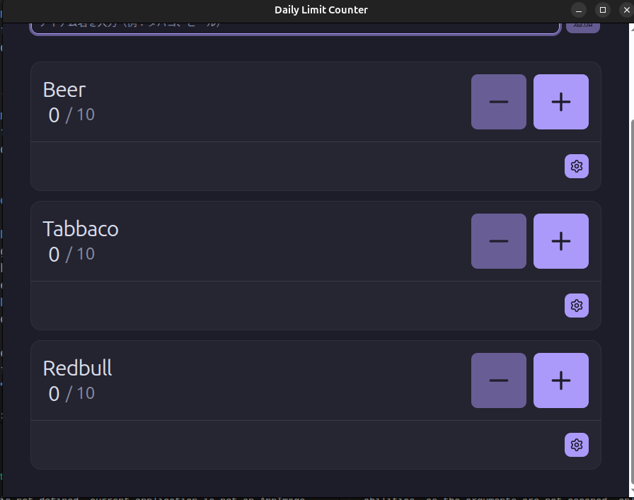
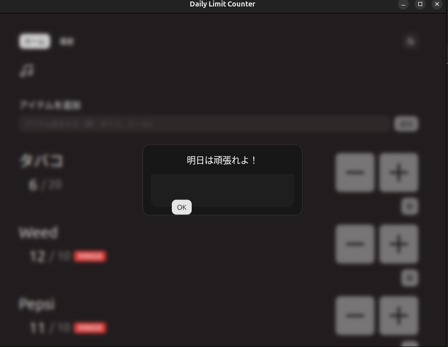

## Daily Limit Counter

  

  

## Features

- **Daily Limit Management**: Track and manage daily consumption limits (e.g., alcohol intake) with a controlled decrement system.
- **Playful Friction (Fleeing Cursor)**: The confirmation button dynamically flees from your mouse pointer when attempting to decrement a count after exceeding your limit.
- **Multi-language Support (i18n)**: localized for global accessibility.
- **history log**

### Install
Linux / Windows

- snap

- deb,zip
  - [Releases](https://github.com/Mr-Pontaman/electron-limit-counter/releases) Page