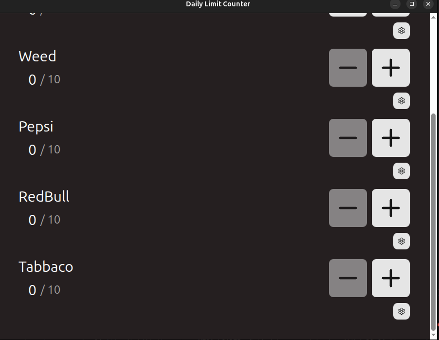
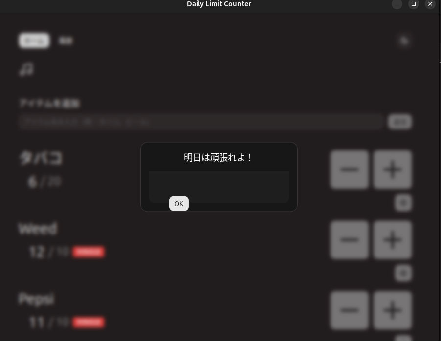

# Daily Limit Counter

<p align="center">
  
</p>

<p align="center">
  
</p>

## Features

- **Daily Limit Management**: Track and manage daily consumption limits (e.g., alcohol intake) with a controlled decrement system.
- **Playful Friction (Fleeing Cursor)**: The confirmation button dynamically flees from your mouse pointer when attempting to decrement a count after exceeding your limit.
- **Multi-language Support (i18n)**: localized for global accessibility.
- **history log**

## Install

Tested and working on Ubuntu 24 and Windows 11.

### Linux

- `.deb` , `AppImage`
  - [Releases](https://github.com/Mr-Pontaman/electron-limit-counter/releases) Page

- Snap

```
sudo snap install limit-counter
```

- [Snap Store](https://snapcraft.io/limit-counter)

### Windows

- `.exe`
  - [Releases](https://github.com/Mr-Pontaman/electron-limit-counter/releases) Page
